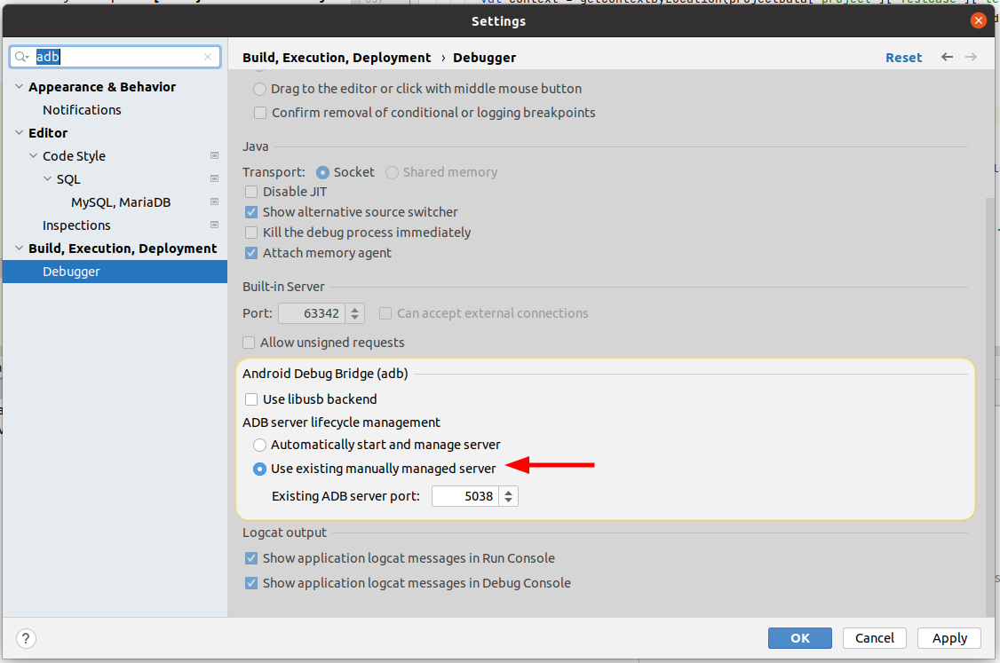

# Android Development (ADB with Projector)

When configuring the environment for IntelliJ or Android Studio to do Android development, extra configuring is needed to handle communication with ADB for client-side emulators or real devices that aren't directly connecting to the server hosting Projector. 

## ADB port forwarding

ADB is the daemon used to communicate with Android devices and runs on port 5037 by default. This port needs to be RemoteForwarded in the SSH connection to enable the IntelliJ instance under Projector instance to see the Android devices.

When configuring SSH, you can Remote Forward port 5037 `ssh -R 5037:127.0.0.1:5037 <hostname>` or by configuring it into your `.ssh/config` file. This will allow the adb binary on the remote server to have visibility into the devices and emulator running locally. 

However IntelliJ aggresively tries to start ADB independently by default, and this can cause a conflict in port forwarding which causes this to fail. This becomes more pronounced in introducing instability with IntelliJ and Projector are ran persistently on the server as a daemon.


## IntelliJ 2021 or later

In recent versions of IntelliJ or Android Studio based on 2021 you can disable the management of ADB under File -> Settings -> Build, Execution, Deployment -> Debugger -> Android server lifecycle management by switching the setting to "use existing manually managed port"



## IntelliJ 2020

On older versions of IntelliJ and Android studio you need to terminate the adb process on the server prior to initiating the SSH connection with port forwarding to enable a consistent experience with a stable connection.

`ssh <hostname> "killall adb" ; ssh -R5037:127.0.0.1:5037 <hostname>`


## Helper functions to establish a stable connection with multiplexing.

Additionally, keeping the SSH session alive with ADB connecting can be simplified by using an ssh multiplexed connection which will keep a dedicated socket for the connection including the port forwarding.

The following shell functions demonstrate connecting and disconnecting ADB to the ssh host using multiplexing with the default ADB port. This is compatible with all versions of IntelliJ and Android Studio.

```
function ssh-connect-adb () {
    host=$1
    #Ensure ABD is running locally
    adb start-server > /dev/null

    #Ensure ADB on the remote is killed
    ssh -q -o ControlMaster=auto -o ControlPath=/tmp/%r@%h-adb -o ControlPersist=2h $host "killall adb"

    #Initiate the ssh port forwarding
    ssh -q -o ControlMaster=auto -o ControlPath=/tmp/%r@%h-adb -o ControlPersist=2h -R5037:127.0.0.1:5037 -O forward $host
}

function ssh-disconnect-adb () {
    host=$1
    #Stop the ssh port forwarding
    ssh -q -o ControlMaster=auto -o ControlPath=/tmp/%r@%h-adb -o ControlPersist=2h -R5037:127.0.0.1:5037 -O cancel $host
}
```

Usage Example:

```
local $ ssh-connect-adb <hostname>
local $ ssh <hostname>

hostname $ adb devices
List of devices attached
emulator-5554   device

hostname $ exit
local $ ssh-disconnect-adb <hostname>

```
